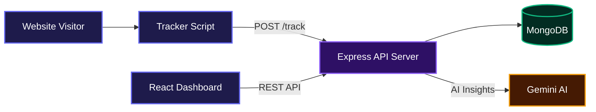
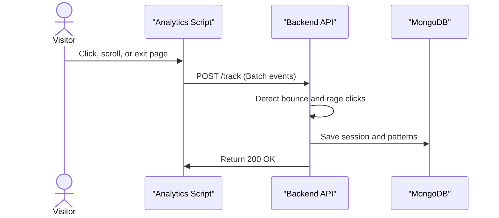
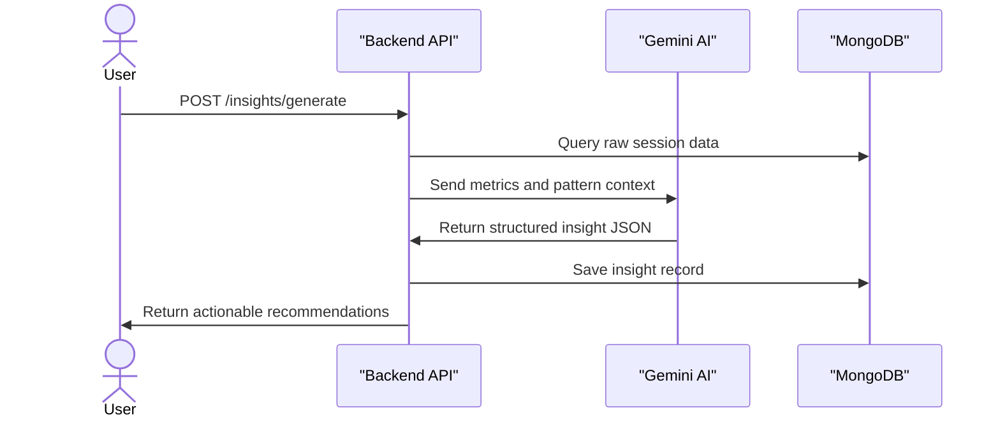

# ExitLens 🔍

> Understand why users leave your landing page - in plain English.

ExitLens tracks visitor behavior (clicks, scroll depth, session time), detects patterns like rage clicks and bounce sessions, and uses AI to explain what went wrong in language any founder can understand.

Live Demo

- 🚀 **Dashboard:** [https://exitlens-app.onrender.com](https://exitlens-app.onrender.com)

## System Architecture



---

## Quick Start

```bash
# 1. Install dependencies
npm install --prefix backend
npm install --prefix frontend

# 2. Configure environment
cp backend/.env.example backend/.env
# Edit .env - add MongoDB URI, JWT secret, AI key

# 3. Run each service from the repository root in a separate terminal
npm run dev --prefix backend  # API on :4000
npm start --prefix frontend   # Dashboard on :3000
```

---

## Features

### Session Tracking & Pattern Detection
ExitLens captures visitor events without slowing down the host page. The backend engine automatically analyzes the incoming data to flag negative behavioral patterns like rage clicks, dead clicks, and immediate bounces.



### AI-Powered Insights
Instead of manually watching replays, teams can trigger an AI analysis on a specific session. The backend sends the session patterns to Gemini AI, which returns plain-English findings and actionable quick wins to improve the landing page.



### Advanced Dashboards & Exporting
Teams can view session heatmaps, chronological timelines, and high-level project statistics directly in the React dashboard. Session lists and AI insights can also be exported natively to CSV or PDF formats.

---

## Embed on Your Landing Page

```html
<script
  src="https://your-api.com/cdn/analytics.js"
  data-api-key="elp_your_project_key_here"
  data-endpoint="https://your-api.com/track"
  async
></script>
```

Optional custom events:
```js
ExitLens.track('cta_clicked', { variant: 'A' });
```

---

## Environment Variables

Configure these values in your backend `.env` file.

```text
NODE_ENV=development
PORT=4000
BASE_URL=http://localhost:4000
MONGODB_URI=mongodb://127.0.0.1:27017/exitlens
JWT_SECRET=your_64_byte_hex_string
JWT_EXPIRES_IN=7d
JWT_COOKIE_MAX_AGE_MS=604800000
ALLOWED_ORIGINS=http://localhost:3000,https://app.yourdomain.com
AI_PROVIDER=gemini
GEMINI_API_KEY=your_gemini_api_key
OPENAI_API_KEY=your_openai_api_key
RATE_LIMIT_AUTH_MAX=5
RATE_LIMIT_TRACK_MAX=200
RATE_LIMIT_API_MAX=100
LOG_LEVEL=info
LOG_DIR=./logs
FRONTEND_URL=http://localhost:3000
```

Frontend `.env.local` configuration:

```text
REACT_APP_API_URL=http://localhost:4000
REACT_APP_ENV=development
```

---

## API Documentation

### Auth Routes

#### POST `/auth/register`
Creates a new account and returns a one-time API key.

Request:
```json
{
  "name": "Jane Doe",
  "email": "jane@example.com",
  "password": "securepassword123"
}
```

Response:
```json
{
  "success": true,
  "data": {
    "user": {
      "_id": "60b8d...",
      "name": "Jane Doe",
      "email": "jane@example.com"
    },
    "apiKey": "el_12345...",
    "message": "Save your API key..."
  }
}
```

#### POST `/auth/login`
Authenticates a user and sets an httpOnly JWT cookie.

Request:
```json
{
  "email": "jane@example.com",
  "password": "securepassword123"
}
```

#### POST `/auth/logout`
Clears the JWT authentication cookie.

#### GET `/auth/me`
Retrieves the currently authenticated user profile based on the JWT cookie.

#### POST `/auth/regenerate-key`
Generates a new global tracker API key for the user, invalidating the old one.

### Project Routes

#### GET `/projects`
Lists all active projects associated with the authenticated user.

Response:
```json
{
  "success": true,
  "data": {
    "projects": [
      {
        "_id": "65ab...",
        "name": "My Landing Page",
        "domain": "example.com"
      }
    ]
  }
}
```

#### POST `/projects`
Creates a new tracking project and returns a unique project API key.

Request:
```json
{
  "name": "Marketing Site",
  "domain": "marketing.example.com",
  "description": "Main funnel",
  "color": "#ff5c5c"
}
```

#### GET `/projects/:id`
Retrieves a specific project's configuration details.

#### PUT `/projects/:id`
Updates a project's settings, privacy modes, or alert thresholds.

#### DELETE `/projects/:id`
Soft-deletes a project. Unlinks but retains historical session data.

#### POST `/projects/:id/regenerate-key`
Generates a new API key for a specific project.

#### GET `/projects/:id/stats`
Aggregates key metrics (bounce rate, conversions, duration) scoped to the project.

#### POST `/projects/:id/goals`
Adds a new conversion goal to the project.

Request:
```json
{
  "name": "Completed Signup",
  "type": "page_visit",
  "value": "/welcome"
}
```

#### DELETE `/projects/:id/goals/:goalId`
Removes an existing conversion goal from the project.

### Session Routes

#### GET `/sessions`
Retrieves a paginated list of recorded sessions, supporting deep filtering.

Response:
```json
{
  "success": true,
  "data": {
    "sessions": [],
    "pagination": {
      "total": 150,
      "page": 1,
      "limit": 20,
      "pages": 8
    }
  }
}
```

#### GET `/sessions/stats`
Fetches high-level metrics across all filtered sessions.

#### GET `/sessions/alerts`
Returns active alerts for sudden spikes in bounce rates or dead clicks over the past 7 days.

#### GET `/sessions/export`
Exports filtered session data as a downloadable CSV or PDF report.

#### GET `/sessions/export-insights`
Exports all AI-generated insights as a CSV or PDF file.

#### GET `/sessions/:id/replay`
Fetches the timeline of raw events (scrolls, clicks, visibility changes) for session reconstruction.

#### GET `/sessions/:id/heatmap`
Returns all coordinate points clicked during the session to generate visual heatmaps.

#### GET `/sessions/:id`
Fetches full details for a single session, including parsed behavioral patterns.

### Insight Routes

#### GET `/insights`
Lists all AI-generated insights created by the user.

#### GET `/insights/:sessionId`
Retrieves a specific insight linked to a session ID.

#### POST `/insights/generate`
Triggers the AI engine to build a structured insight report based on session behavior.

Request:
```json
{
  "sessionId": "65ac12..."
}
```

Response:
```json
{
  "success": true,
  "data": {
    "insight": {
      "summary": "User left rapidly due to hidden call to action.",
      "overallScore": 3,
      "findings": [
        {
          "severity": "critical",
          "title": "Immediate Bounce",
          "description": "User left within 4 seconds.",
          "recommendation": "Move primary CTA above the fold."
        }
      ]
    }
  }
}
```

### Tracking Routes

#### POST `/track`
Receives batched behavioral events from the frontend tracking script. Protected by API key.

Request:
```json
{
  "sessionId": "uuid-1234",
  "apiKey": "elp_abc123",
  "pageUrl": "https://example.com",
  "events": [
    {
      "type": "click",
      "ts": 1640001000,
      "element": "button#submit"
    }
  ]
}
```

### Health

#### GET `/health`
Returns the status and uptime of the backend API.

Response:
```json
{
  "status": "ok",
  "env": "development",
  "uptime": 3600,
  "timestamp": "2024-03-24T12:00:00.000Z"
}
```

---

## Security Highlights

- ✅ JWT in httpOnly cookies (not localStorage)
- ✅ CORS whitelist only
- ✅ All routes protected with auth middleware
- ✅ IDOR prevented - every query scoped to `userId`
- ✅ Joi input validation + `stripUnknown` on all endpoints
- ✅ Rate limiting per route group
- ✅ Passwords never returned in responses (`select: false`)
- ✅ Timing-safe login (prevents email enumeration)
- ✅ Helmet security headers
- ✅ Payload size limits
- ✅ No hardcoded secrets - env var validation at startup

See `./docs/SECURITY_AUDIT.md` for the full before/after audit.

---

## Project Structure

```text
saas-analytics/
├── tracker/
│   └── analytics.js          # Embed snippet (<3KB, zero deps)
│
├── backend/
│   ├── src/
│   │   ├── controllers/      # authController, trackController, projectController, etc.
│   │   ├── models/           # User, Session, Insight, Project (Mongoose)
│   │   ├── routes/           # auth, track, sessions, insights, projects
│   │   ├── middleware/       # auth (JWT+ApiKey), rateLimiter, validate, errorHandler
│   │   ├── services/         # patternEngine, aiEngine
│   │   └── utils/            # logger (Winston), config
│   ├── tests/                # Integration + security tests
│   ├── server.js             # Entry with graceful shutdown
│   └── .env.example
│
├── frontend/
│   └── src/
│       ├── pages/            # Login, Register, Dashboard, Sessions, Projects, etc.
│       ├── components/       # Layout, UI primitives, Heatmap
│       ├── hooks/            # useAuth, useData
│       ├── services/         # api.js (axios)
│       └── utils/            # format.js
│
├── docs/
│   ├── DEPLOYMENT.md
│   └── SECURITY_AUDIT.md
│
└── ecosystem.config.js       # PM2 cluster config
```

---

## Technologies Used

- **Backend:** Node.js, Express
- **Database:** MongoDB, Mongoose
- **Authentication:** JWT (httpOnly cookies), bcryptjs
- **Validation:** Joi
- **AI Integration:** Gemini API (via native fetch)
- **Security:** Helmet, express-rate-limit, cors
- **Logging:** Winston, winston-daily-rotate-file, morgan
- **Frontend:** React 18, React Router, Framer Motion
- **Data Visualization:** Recharts, HTML Canvas (Heatmaps)
- **Process Management:** PM2

---

## License

No license file is currently included. Unless a license is added, the repository's source remains under the author's default copyright.

[](https://dokugen.samueltuoyo.com)
